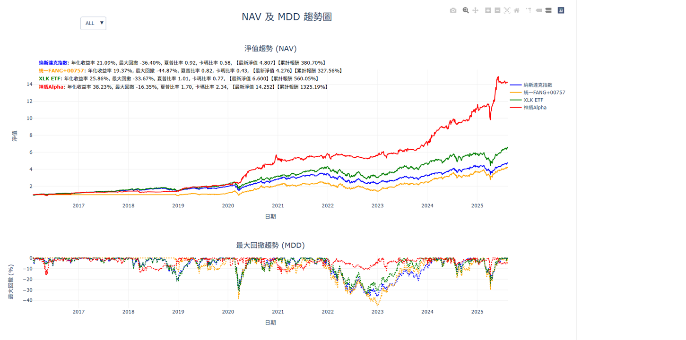
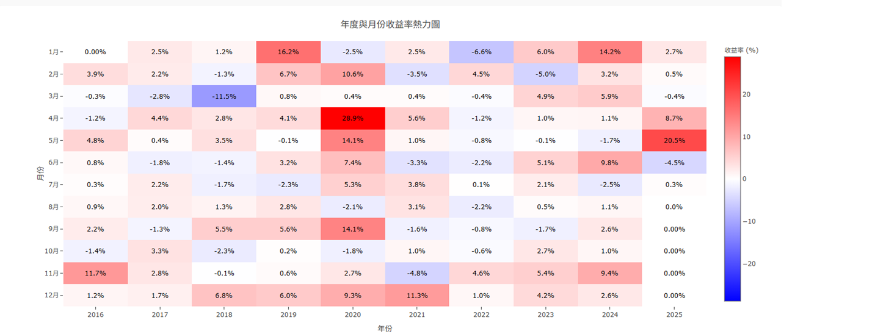
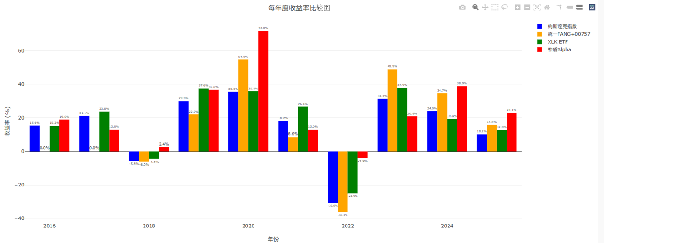
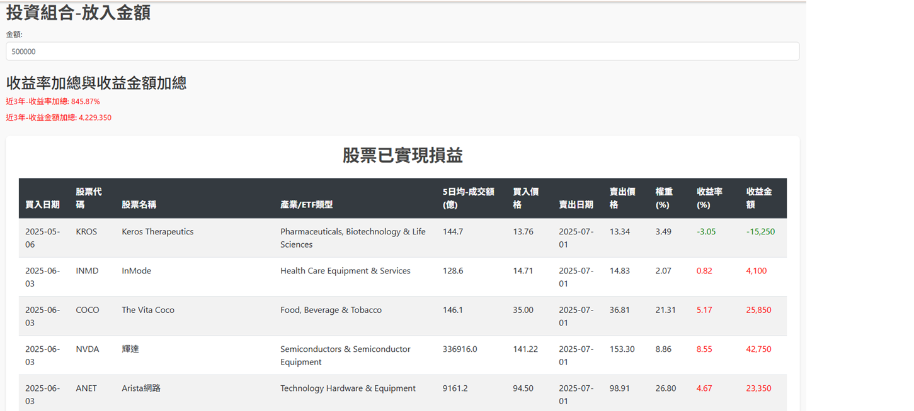

# 策略編號：Aegis Alpha
## 策略名稱：神盾 Alpha

### 📖 策略介紹
神盾 Alpha 是一套結合 **事件驅動 + 多因子選股 + 防禦配置** 的動態資產配置策略，專注於在不同市場環境中維持 **穩定報酬** 與 **控制回撤**。

---

### 🌟 核心優勢
- **事件驅動選股**：僅針對近期有事件的標的進行分析，有效提升因子預測力與勝率  
- **多因子嚴選**：從接近 200 個財務與動能因子中挑選進行評分  
- **動態持股數調整**：依分數分布決定持股數量，強勢市況提高曝險，弱勢市況自動收縮  
- **防禦資產切換**：當市場風險升高，自動轉向低波動資產  
- **因子去重與穩定性檢查**：自動剔除冗餘因子，保持模型多元性與穩健性  

---

### ⚙️ 交易邏輯
- **選股條件**：每次選股基於最新事件型因子排名，篩選出分數最高的標的，並根據分布調整持股數量  
- **進出場機制**：每月調整一次持倉，若市場翻轉則提前再平衡  
- **出場機制**：事件效應衰退、因子分數跌出排名區間，或市場轉空時自動退出  
- **收盤價執行**：所有交易均以收盤價成交，避免盤中噪音干擾  

---

## 📊 策略績效展示

### NAV 與 MDD 趨勢圖 
bench mark：納斯達克、統一 FANG+ 00757、XLK ETF  
主策略：神盾 Alpha

---

### 年度與月份收益率熱力圖

---

### 每年度收益率比較圖

---

### 2025年投資組合實現損益5月與6月

---

## 📈 總結
- 年化報酬率 (CAGR)：**38.23%**  
- 最大回撤 (MDD)：**-16.35%**  
- 夏普比率：**1.70**  
- Calmar Ratio：**2.34**  

神盾 Alpha 透過 **非線性因子交互** 與 **動態風險控制**，在不同市場環境中展現穩健績效與顯著的抗風險能力。
